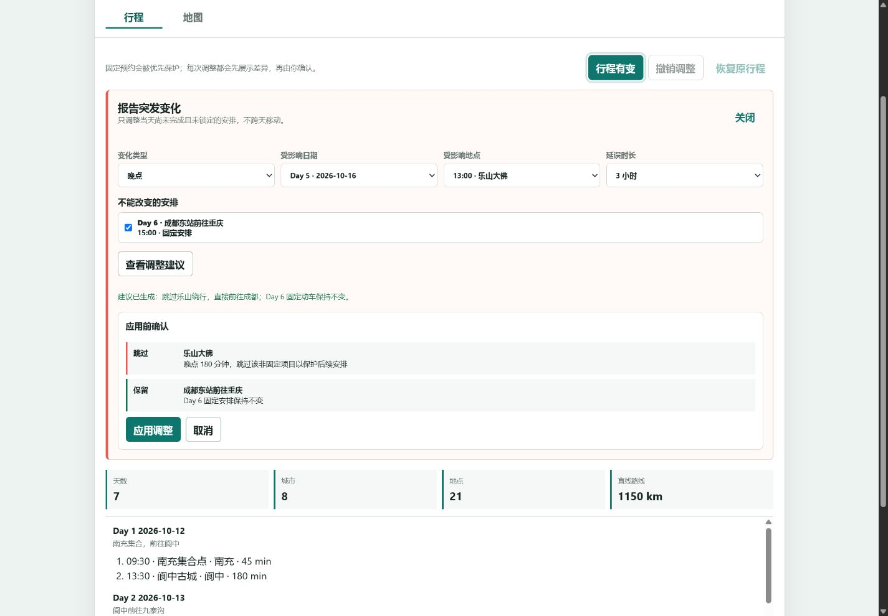
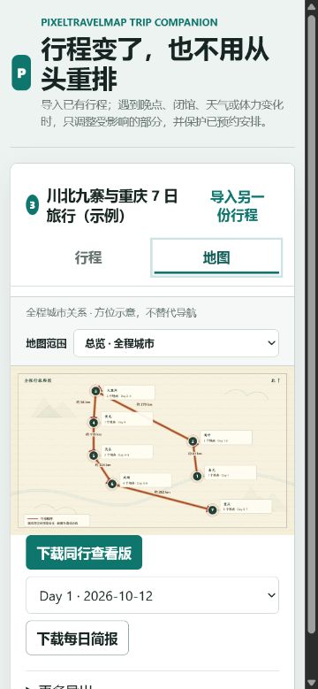

# PixelTravelMap

PixelTravelMap 是一个离线优先的旅行行程助手。它把已有 Word 或文字行程整理成时间线和城市关系地图；旅行中出现晚点、闭馆、天气或体力变化时，可以在保护固定预约的前提下，局部调整当天后续安排。

项目无需账号、后端或 API key，生成的 HTML、JSON 和 SVG 可以独立保存与分享。

## 在线体验

- [统一产品入口](https://leoxin99.github.io/PixelTravelMap/dist/index.html)
- [同行分享查看器](https://leoxin99.github.io/PixelTravelMap/dist/viewer.html)
- [意法瑞 8 日自驾 Demo](https://leoxin99.github.io/PixelTravelMap/dist/italy_france_switzerland_demo.html)

## 成果展示

| 桌面端：应用前查看调整差异 | 手机端：调整后路线地图 |
| --- | --- |
|  |  |

## 核心功能

- 上传 `.docx` 或粘贴文字行程，整理为可编辑的 Day 时间线
- 总览以城市级方位展示全程关系，每日地图独立放大当天地点
- 古风舆图会适度压缩远距离并自动避让标签，保持方向和行程顺序清晰
- 报告晚点、地点关闭、天气影响或体力不足
- 先展示“保留、顺延、跳过”差异，再由使用者确认调整
- 自动保护已预约项目，不跨天移动，也不编造替代景点
- 同步更新当前行程、地图、每日简报和下载内容
- 导出同行查看版 HTML、每日简报及旅行 Poster
- 当前计划、原计划和变化记录仅保存在浏览器本地

## 使用方法

1. 打开[统一产品入口](https://leoxin99.github.io/PixelTravelMap/dist/index.html)。
2. 点击“加载示例行程”，可直接体验完整流程；也可以上传自己的 `.docx`。
3. 在“行程”页点击“行程有变”，选择变化并查看调整建议。
4. 确认差异后应用，切换到“地图”查看更新路线或下载每日简报。

演示主线只需要三次操作：

```text
加载示例行程 -> 行程有变 -> 应用调整
```

内置示例使用虚构日期和公共地点，用于体验路线调整流程，不作为实际交通或游玩建议。

## 本地运行

需要 Python 3.10 或以上版本，无第三方依赖。

```powershell
git clone git@github.com:leoxin99/PixelTravelMap.git
cd PixelTravelMap
python scripts/build_builder.py
python scripts/build_viewer.py
python scripts/check_project.py
```

直接打开 `dist/index.html` 即可使用。

## 项目结构

```text
pixel_travel_map/   导入、校验、地图与 Poster 渲染
scripts/            构建和自动检查
examples/           示例输入与期望数据
schemas/            行程 JSON Schema
dist/               GitHub Pages 可发布产物
```

## 当前状态

当前已支持：离线导入、差异预览、局部重规划、撤销与恢复、地图和简报同步、本地匿名事件记录。

仍待真实使用验证：调整建议接受率、完成一次改行程所需时间、手工改回比例、每日简报分享率。项目不会把合成用户研究或演示数据表述为真实市场验证。

## 限制

- “实时更新”指使用者报告变化后在浏览器即时计算，不接入实时天气或交通。
- 地图呈现城市级相对方位，距离为直线近似值，不替代导航。
- 当前不接入高德或百度底图，使用者无需配置 Key，下载后的地图也可离线查看。
- 自动规则只调整已有行程；信息不足或固定安排发生冲突时会停止并要求人工确认。
- 第一版支持 `.docx`，暂不支持旧版 `.doc`、PDF 和扫描件。

## License

MIT
