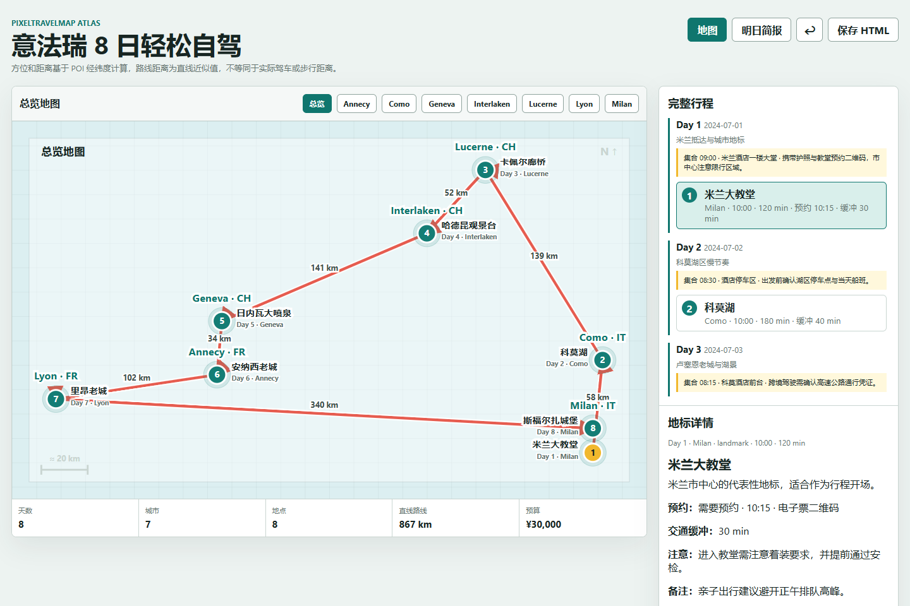
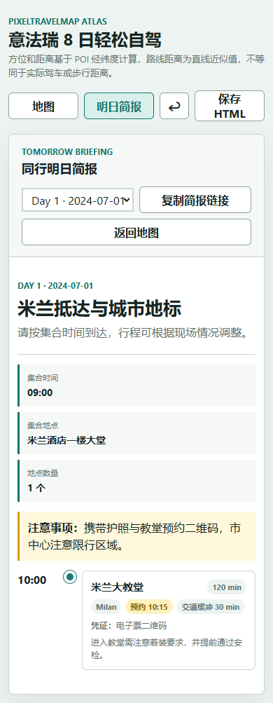

# PixelTravelMap

PixelTravelMap 是一个离线优先的旅行行程工具：把 Word 或自然语言行程整理成可交互地图、同行明日简报和一页式 SVG 海报。

项目无需后端和 API key。生成的 HTML、JSON 与 SVG 可独立保存和打开，适合旅行前规划、途中协作和旅行后记录。

## 在线体验

- [创建自己的地图](https://leoxin99.github.io/PixelTravelMap/dist/builder.html)
- [意法瑞 8 日自驾 Demo](https://leoxin99.github.io/PixelTravelMap/dist/italy_france_switzerland_demo.html)
- [日本关西城市旅行 Demo](https://leoxin99.github.io/PixelTravelMap/dist/japan_kansai_demo.html)
- [北京亲子游 Demo](https://leoxin99.github.io/PixelTravelMap/dist/beijing_family_demo.html)

## 成果展示

| 桌面端行程地图 | 手机端明日简报 |
| --- | --- |
|  |  |

## 主要功能

- 上传 `.docx` 或粘贴自然语言行程，生成可编辑草稿
- 可选使用 OpenStreetMap 确认城市级方位，同城景点自动复用
- 以旅行故事地图展示城市方向、路线关系和近似距离，不替代导航
- 记录集合时间、到达时间、预约信息、交通缓冲和注意事项
- 生成总行程、每日简报和旅行记录 SVG poster
- 通过链接分享完整行程或指定日期的手机简报
- 使用带作者和时间戳的 JSON 更新包导入、导出同行备注
- 备注保存在浏览器 `localStorage`，不会上传到服务器

## 使用方法

### 浏览器创建

1. 打开[在线创建器](https://leoxin99.github.io/PixelTravelMap/dist/builder.html)。
2. 上传 `.docx` 或粘贴旅行计划，点击“整理我的行程”。
3. 确认标题、日期、城市和地点顺序；无需逐个填写景点坐标。
4. 缺少方位时按城市确认一次，然后点击“生成旅行地图”。
5. 下载互动 HTML 或指定日期的每日简报；更多格式收在导出菜单中。

分享链接把行程快照放在 URL fragment 中，不会随网页请求发送给服务器。项目保持纯静态架构，因此同行协作采用“导出更新包、导入合并”的异步方式，不宣称实时多人编辑。

### 本地生成

需要 Python 3.10 或以上版本，无第三方依赖。

```powershell
git clone git@github.com:leoxin99/PixelTravelMap.git
cd PixelTravelMap
python scripts/check_project.py
```

生成示例：

```powershell
python scripts/generate_map.py `
  --input examples/inputs/tokyo_coordinate_trip.txt `
  --output dist/tokyo_coordinate_demo.html `
  --dump-json dist/tokyo_coordinate_demo.json `
  --poster-svg dist/tokyo_coordinate_demo_poster.svg
```

地点输入示例：

```text
Day 1：东京塔和城市观景
- 东京塔 (lat:35.6586, lon:139.7454, city:Tokyo, country:JP, category:landmark, duration:90, arrival:09:30, reservation:true, reservation_time:09:30, buffer:20, caution:提前取票)
```

支持的 `category`：

```text
landmark, museum, food, hotel, nature, transit, shopping, experience, viewpoint
```

## 常用命令

```powershell
# 重建在线创建器和分享查看器
python scripts/build_builder.py --output dist/builder.html
python scripts/build_viewer.py --output dist/viewer.html

# 校验全部源码和产物
python scripts/check_project.py

# 校验单个 HTML 或 SVG
python scripts/check_artifact.py dist/italy_france_switzerland_demo.html
```

## 项目结构

```text
pixel_travel_map/   解析、校验与渲染
scripts/            构建和检查命令
examples/           示例输入与期望数据
schemas/            行程 JSON Schema
dist/               可直接发布的 HTML、JSON、SVG
```

## 限制

- 地图距离是基于经纬度的直线近似值，不等同于实际道路距离。
- 在线定位不会自动请求，只在用户主动点击补全城市方位时访问 Nominatim。
- 支持 `.docx`，暂不支持旧版 `.doc`、PDF 和扫描件。
- 分享链接可能较长；复杂行程更适合发送下载后的 HTML 文件。

## License

MIT
